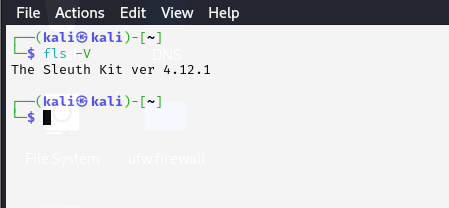
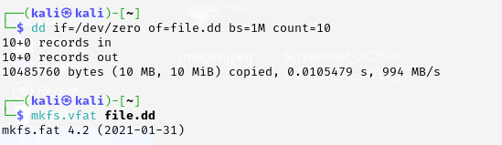
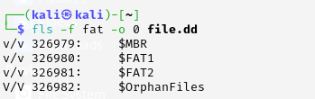
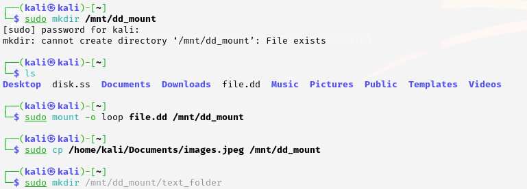
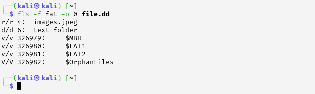

# Analysis-of-the-Disk-Structure-using-Sleuth-Kit
## AIM:
To analyze the disk structure of a given disk image using Sleuth Kit tools in Kali Linux.

## DESIGN STEPS:
### Step 1:
Obtain or create a disk image file (e.g., disk.dd) to analyze. Open the terminal in Kali Linux.

### Step 2:
Use Sleuth Kit tools like mmls, fsstat, and fls to examine the partition layout, file system details, and file listing.

### Step 3:
Interpret the output of the tools to understand the disk structure, including partitions, sectors, and files.

## PROGRAM:
Sleuth Kit Disk Analysis Commands

✅ Option 1: Create a Sample Disk Image (for Testing)

Let’s create a 10MB blank disk image and simulate file system activity:

```bash
cd ~/Downloads

# Step 1: Create an empty disk image
dd if=/dev/zero of=file.dd bs=1M count=10

# Step 2: Format it with a file system (like FAT32)
mkfs.vfat file.dd
```

## OUTPUT:


### Create Disk

### mmls 
```bash
mmls disk.dd
```
### fls
```bash
fls -f fat -o 0 disk.dd
```






## RESULT:
The analysis was performed successfully using Sleuth Kit, and the disk structure was understood in detail.
